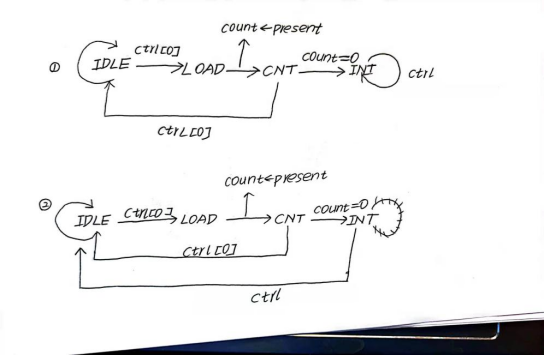
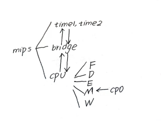
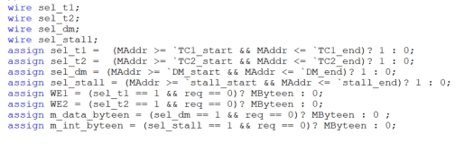
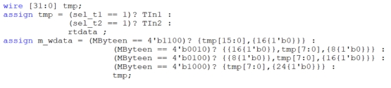
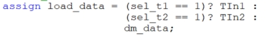
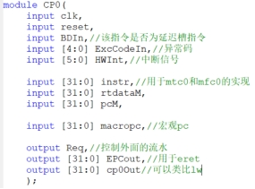
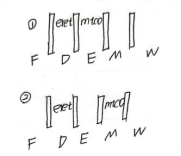
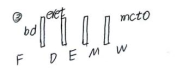

# 介绍

p7也有一些相关的文档，整挺好

p7就更加复杂了，说实话，p7比p6的跨度个人感觉大于p5比p4

p7主要是增加了一些外设，如果理论学的不好，到这部分会很难理解的

# 提问

1. 请查阅相关资料，说明鼠标和键盘的输入信号是如何被 CPU 知晓的？

   > 当键盘上按下一个按键的时候，键盘会发出一个中断信号，中断信号经过中断控制器传到CPU，然后CPU根据不同的中断号执行不同的中断响应程序，然后进行相应的IO操作，把按下的按键编码读到寄存器（或者鼠标的操作），最后放入内存中。

2. 请思考为什么我们的 CPU 处理中断异常必须是已经指定好的地址？如果你的 CPU 支持用户自定义入口地址，即处理中断异常的程序由用户提供，其还能提供我们所希望的功能吗？如果可以，请说明这样可能会出现什么问题？否则举例说明。（假设用户提供的中断处理程序合法）

   > 不能提供所需要的功能。
   >
   > 用户提供的地址可能位于内存的其他功能区

3. 为何与外设通信需要 Bridge？

   > dm模块提供了一个地址，这个地址可能位于任何一个功能区，需要桥把地址和功能区一一映射

4. 请阅读官方提供的定时器源代码，阐述两种中断模式的异同，并针对每一种模式绘制状态移图。

   > 一种是到点了停止计时，另一种是到点了重新开始计时 

5. 倘若中断信号流入的时候，在检测宏观 PC 的一级如果是一条空泡（你的 CPU 该级所有信息均为空）指令，此时会发生什么问题？在此例基础上请思考：在 P7 中，清空流水线产生的空泡指令应该保留原指令的哪些信息？

   > 如果产生中断的话，这个时候写入EPC的指令会是一条nop
   >
   > 保留信息：pc，是否为延迟槽指令

6. 为什么 jalr 指令为什么不能写成 jalr \$31$,31？

   > 当跳转的目标地址是错误的时候，会把错误的地址写进$31

 

# P7设计文档

## 整体架构：

 

### 关于bridge：

Bridge主要是用来处理各种使能信号：

### s型指令

1. cpu把dm的地址，写使能信号，GPR[rt]的值输出，传递给bridge。

   dm的地址：aluOutM;

   写使能信号:根据store型指令来判断

   GPR[rt]:转发处理的GPR[rt]

2. bridge根据dm的地址和写使能信号，为各个部件的使能信号赋值，并对GPR[rt]进行处理（把要写入的字节根据使能信号移动到相应的位置上）

### l型指令

1. cpu把dm的地址输出，传递给bridge

2. bridge根据dm的地址来判断应该存入的值，主要来源有三个：timer1,timer2,m_data_rdata

   要把这两个功能在一个模块里实现，需要进行简化：

   这是对使能信号的实现

    

   这是对s数据的选择

    

   这是对l数据的选择

    

## CPU的内部实现

比之前的模块，需要改动的地方如下：

### 新增cp0模块

 

### 每级流水的改变

1. 新增一个信号，代表该信号是否为有效指令（有效指令：该信号不为stall或req或reset产生的nop信号）

2. DE寄存器在因为stall插入空泡的时候，需要标记该nop的bd属性

### 对eret的实现

在实现上，我选择把eret放在D级，并清空延迟槽，主要的思路如下：

1. 这两种情况需要阻塞

    

2. 直到这种情况出现为止

    

3. 此时FD插入一个nop，这个nop对应的宏观pc应该是eret的目标指令，因为eret没有延迟槽
